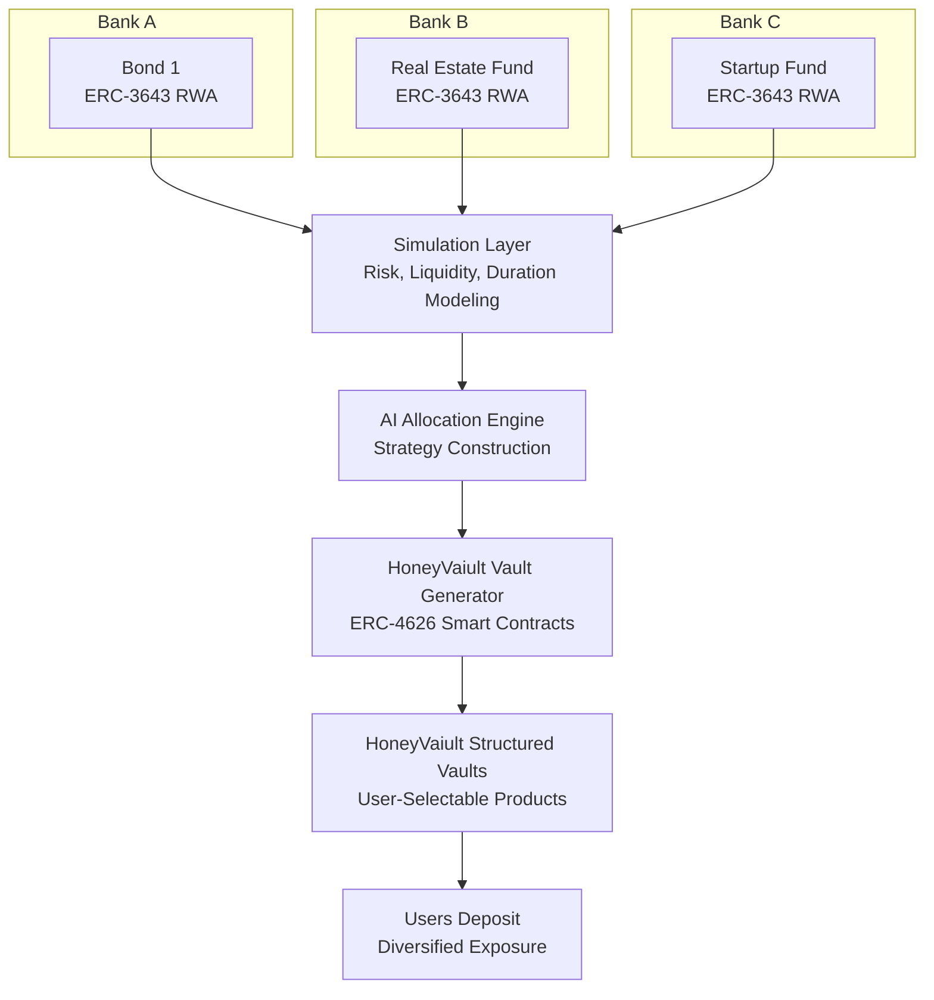

# HoneyVaiult

**AI-Generated ERC-4626 Vaults Built From ERC-3643 Real-World Assets**

## Overview

HoneyVaiult is a vault-generation engine that turns regulated financial products (RWAs) issued by institutions on Rayls private nodes into AI-assembled ERC-4626 vaults.

Each institution (Bank A, Bank B, Bank C, etc.) operates a private Rayls node and issues ERC-3643-compliant RWA tokens (bonds, real-estate funds, startup funds, etc.). HoneyVaiult analyzes these RWAs, simulates risk profiles, and passes the results into an AI allocation engine that constructs ERC-4626 vault strategies.

These vaults act like "honey cells" in a honeycomb — modular financial building blocks that users can choose from depending on risk, duration, and diversification.

## Motivation

### Banks / Institutions

Banks running Rayls private nodes want:

- more liquidity across their financial products
- increased demand for their tokenized RWAs
- better distribution channels
- composable products for broader investors

### Rayls

Rayls benefits from:

- more private nodes onboarded
- increased RWA issuance
- deeper institutional adoption
- more activity on the network

### Users

Users want:

- diversified investment vaults
- simple abstraction over complex RWAs
- clear risk categories
- automated portfolio construction

**HoneyVaiult satisfies all three.**

## Architecture

## System Breakdown

### 1. Private Node Layer (Institutions)

Each participating bank runs a private Rayls node, issuing ERC-3643 RWAs such as:

- corporate bonds
- real-estate investment products
- startup investment funds
- revenue-sharing agreements
- credit risk pools

Each product includes identity gating, transfer restrictions, and compliance enforcement.

### 2. Simulation Layer

HoneyVaiult models each ERC-3643 product by simulating:

- yield curves
- credit/default risk
- volatility
- maturity and duration
- redemption/liquidity windows
- counterparty risk

Outputs a standardized risk signature per product.

### 3. AI Allocation Engine

The AI takes all risk signatures and constructs optimal vault strategies by considering:

- risk tiers
- duration buckets
- diversification needs
- regulatory constraints
- modeled performance scenarios

Produces a set of vault candidates.

### 4. ERC-4626 Vault Generator

Each AI-created strategy is compiled into a deployable ERC-4626 Vault, ready for deposits.

These vaults are:

- compliant
- structured
- composed of multiple ERC-3643 RWAs
- dynamically generated
- optimized for diversification

### 5. HoneyVaiult User Interface

Users see the vaults created by the AI, such as:

- conservative short-term vault
- real-estate heavy vault
- startup exposure vault
- balanced diversified vault
- high-yield long-term vault

Each vault is represented as an ERC-4626 contract containing a honeycomb of ERC-3643 assets.
