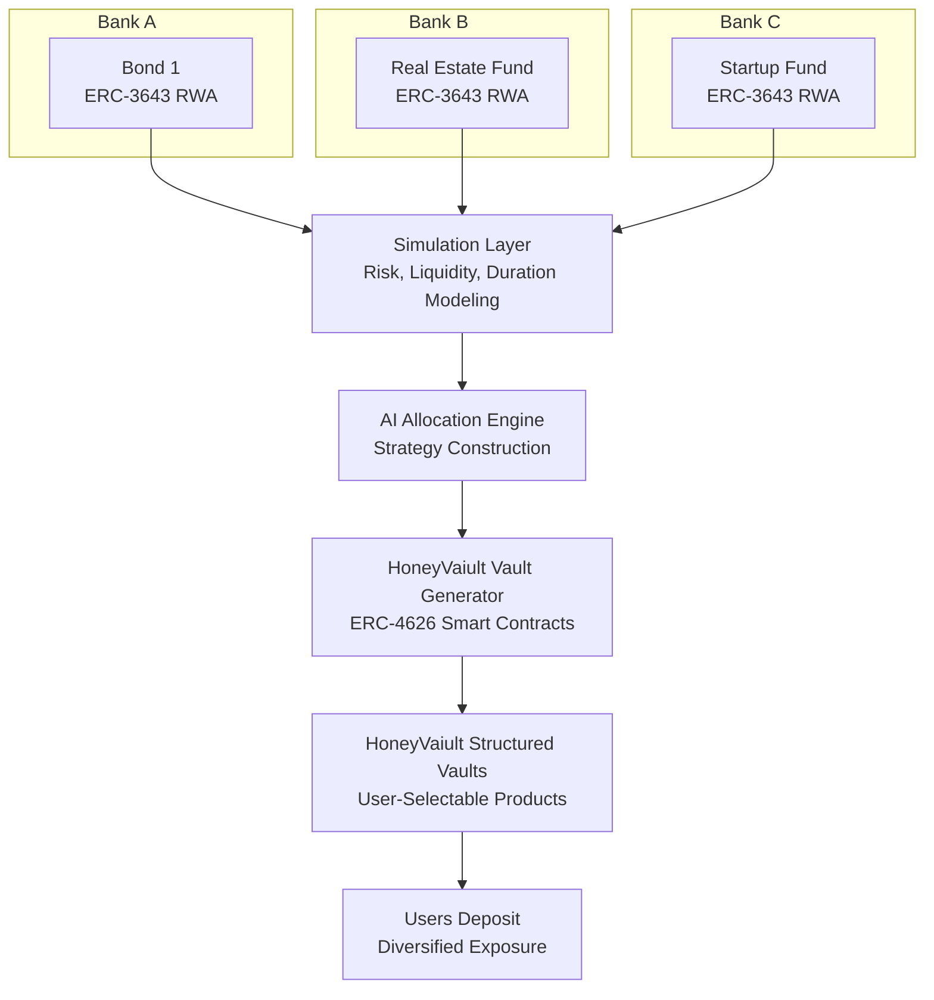

# HoneyVaiult

**AI-Generated ERC-4626 Vaults Built From ERC-3643 Real-World Assets**

## Overview

HoneyVaiult is a vault-generation engine that turns regulated financial products (RWAs) issued by institutions on Rayls private nodes into AI-assembled ERC-4626 vaults.

Each institution (Bank A, Bank B, Bank C, etc.) operates a private Rayls node and issues ERC-3643-compliant RWA tokens (bonds, real-estate funds, startup funds, etc.). HoneyVaiult analyzes these RWAs, simulates risk profiles, and passes the results into an AI allocation engine that constructs ERC-4626 vault strategies.

These vaults act like "honey cells" in a honeycomb — modular financial building blocks that users can choose from depending on risk, duration, and diversification.

## Motivation

### Banks / Institutions

Banks running Rayls private nodes want:

- more liquidity across their financial products
- increased demand for their tokenized RWAs
- better distribution channels
- composable products for broader investors

### Rayls

Rayls benefits from:

- more private nodes onboarded
- increased RWA issuance
- deeper institutional adoption
- more activity on the network

### Users

Users want:

- diversified investment vaults
- simple abstraction over complex RWAs
- clear risk categories
- automated portfolio construction

**HoneyVaiult satisfies all three.**

## Architecture



## System Breakdown

### 1. Private Node Layer (Institutions)

Each participating bank runs a private Rayls node, issuing ERC-3643 RWAs such as:

- corporate bonds
- real-estate investment products
- startup investment funds
- revenue-sharing agreements
- credit risk pools

Each product includes identity gating, transfer restrictions, and compliance enforcement.

### 2. Simulation Layer

HoneyVaiult models each ERC-3643 product by simulating:

- yield curves
- credit/default risk
- volatility
- maturity and duration
- redemption/liquidity windows
- counterparty risk

Outputs a standardized risk signature per product.

### 3. AI Allocation Engine

The AI takes all risk signatures and constructs optimal vault strategies by considering:

- risk tiers
- duration buckets
- diversification needs
- regulatory constraints
- modeled performance scenarios

Produces a set of vault candidates.

### 4. ERC-4626 Vault Generator

Each AI-created strategy is compiled into a deployable ERC-4626 Vault, ready for deposits.

These vaults are:

- compliant
- structured
- composed of multiple ERC-3643 RWAs
- dynamically generated
- optimized for diversification

### 5. HoneyVaiult User Interface

Users see the vaults created by the AI, such as:

- conservative short-term vault
- real-estate heavy vault
- startup exposure vault
- balanced diversified vault
- high-yield long-term vault

Each vault is represented as an ERC-4626 contract containing a honeycomb of ERC-3643 assets.

## Getting Started

### Quick Start

See [QUICKSTART.md](./QUICKSTART.md) for a 5-minute setup guide.

### Installation

1. **Install Foundry:**
   ```bash
   curl -L https://foundry.paradigm.xyz | bash
   foundryup
   ```

2. **Install Dependencies:**
   ```bash
   make install
   cd offchain && python3 -m venv venv && source venv/bin/activate
   pip install -r requirements.txt
   ```

3. **Deploy to Rayls Devnet:**
   ```bash
   forge script script/Deploy.s.sol:DeployScript \
     --rpc-url https://devnet-rpc.rayls.com \
     --broadcast
   ```

See [SETUP.md](./SETUP.md) for detailed setup instructions.

## Project Structure

```
honeyvaiult/
├── src/
│   ├── interfaces/
│   │   └── IERC3643.sol          # ERC-3643 RWA interface
│   ├── mocks/
│   │   └── MockERC3643.sol       # Mock RWA tokens for testing
│   ├── HoneyVault.sol             # ERC-4626 vault implementation
│   └── HoneyVaultFactory.sol     # Vault factory contract
├── script/
│   └── Deploy.s.sol              # Deployment script
├── src/test/
│   └── HoneyVault.t.sol         # Foundry tests
├── offchain/
│   ├── simulation/
│   │   └── risk_model.py         # Risk simulation layer
│   ├── ai_engine/
│   │   └── allocation_engine.py   # AI allocation engine
│   └── vault_generator.py         # Main orchestrator
├── frontend/
│   ├── index.html                # Web interface
│   └── app.js                    # Frontend logic
├── foundry.toml                  # Foundry configuration
├── README.md
├── SETUP.md                      # Detailed setup guide
├── QUICKSTART.md                 # Quick start guide
└── HACKATHON_RULES.md           # Rayls hackathon rules
```

## Key Components

### Smart Contracts

- **`HoneyVault.sol`**: ERC-4626 compliant vault that holds multiple ERC-3643 RWA tokens
- **`HoneyVaultFactory.sol`**: Factory contract for deploying vaults from AI-generated strategies
- **`MockERC3643.sol`**: Mock implementation of ERC-3643 for testing and demos

### Off-Chain Components

- **Risk Simulation Layer**: Models risk profiles for RWA tokens (credit score, volatility, liquidity, etc.)
- **AI Allocation Engine**: Constructs optimal vault strategies based on risk signatures
- **Vault Generator**: Orchestrates the full pipeline from RWA tokens to deployable vault configs

### Frontend

- Web interface for viewing and interacting with vaults
- Wallet integration (MetaMask, etc.)
- Deposit/withdraw functionality

## Development

### Build

```bash
make build
```

### Test

```bash
make test
```

### Generate Vault Strategies

```bash
cd offchain
python vault_generator.py
```

## Rayls Integration

HoneyVaiult is built for the **Rayls ecosystem**:

- **Chain**: Rayls Public Chain (EVM compatible)
- **Devnet**: `https://devnet-rpc.rayls.com` (Chain ID: 123123)
- **Gas Token**: USDgas (USDr)
- **Explorer**: `https://devnet-explorer.rayls.com`

See [HACKATHON_RULES.md](./HACKATHON_RULES.md) for hackathon requirements.

## License

MIT
