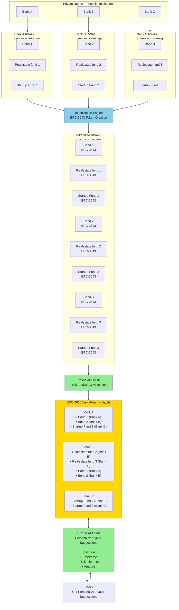

# Praxos

**AI-Generated ERC-4626 Vaults Built From ERC-3643 Real-World Assets**

## Overview

Praxos is a complete system for tokenizing Real-World Assets (RWAs), managing them in yield-bearing vaults, and providing personalized vault suggestions to users via an AI agent.

The system flow: Financial institutions (Bank A, B, C, etc.) issue financial products (bonds, real-estate funds, startup funds) on private Rayls nodes. These products are tokenized into ERC-3643 compliant tokens via a Tokenization Engine. The Praxos AI Engine then analyzes these tokenized RWAs, performs risk analysis and allocation optimization, and creates diversified ERC-4626 yield-bearing vaults. Finally, the Praxos AI Agent provides personalized vault suggestions to users based on their timeframe, risk tolerance, and investment amount.

These vaults act like "honey cells" in a honeycomb — modular financial building blocks that users can choose from depending on risk, duration, and diversification.

## Motivation

### Banks / Institutions

Banks running Rayls private nodes want:

- more liquidity across their financial products
- increased demand for their tokenized RWAs
- better distribution channels
- composable products for broader investors

### Rayls

Rayls benefits from:

- more private nodes onboarded
- increased RWA issuance
- deeper institutional adoption
- more activity on the network

### Users

Users want:

- diversified investment vaults
- simple abstraction over complex RWAs
- clear risk categories
- automated portfolio construction

**Praxos satisfies all three.**

## Architecture

For a detailed system flowchart, see [PraxosFlowchart.md](./PraxosFlowchart.md).



## System Breakdown

### 1. Private Node Layer (Financial Institutions)

Each participating bank (Bank A, Bank B, Bank C, etc.) runs a private Rayls node, issuing financial products such as:

- corporate bonds
- real-estate investment products
- startup investment funds
- revenue-sharing agreements
- credit risk pools

Each product includes identity gating, transfer restrictions, and compliance enforcement.

### 2. Tokenization Engine

The Tokenization Engine converts financial products into **ERC-3643 compliant tokens**, enabling blockchain-based representation of real-world assets.

- Takes raw financial products from institutions
- Converts them to ERC-3643 standard tokens
- Example: "Financial product Bond 1" → "ERC-3643 Token Bond 1"
- Enables composability and interoperability on-chain

### 3. Tokenized RWAs

All financial products are tokenized as **ERC-3643 tokens**, creating a standardized on-chain representation of real-world assets from multiple institutions.

### 4. Risk Simulation Layer

Praxos models each ERC-3643 tokenized product by simulating:

- yield curves
- credit/default risk
- volatility
- maturity and duration
- redemption/liquidity windows
- counterparty risk

Outputs a standardized risk signature per product.

### 5. Praxos AI Engine

The Praxos AI Engine processes tokenized RWAs and performs:

- **Risk Analysis**: Evaluates risk profiles for all tokenized assets
- **Allocation Optimization**: Constructs optimal vault strategies by considering:
  - risk tiers
  - duration buckets
  - diversification needs
  - regulatory constraints
  - modeled performance scenarios

Produces a set of vault candidates with optimal asset allocations.

### 6. ERC-4626 Yield-Bearing Vaults

Each AI-created strategy is compiled into a deployable ERC-4626 Vault, ready for deposits.

These vaults are:

- compliant with ERC-4626 standard
- structured and diversified
- composed of multiple ERC-3643 RWAs
- dynamically generated by the AI
- optimized for risk-adjusted returns

Example vaults:
- **Vault A**: Bond 1 (Bank A), Bond 2 (Bank B), Startup Fund 3 (Bank C)
- **Vault B**: Realestate fund 2 (Bank B), Realestate fund 3 (Bank C), Bond 1 (Bank A), Bond 2 (Bank B)
- **Vault C**: Startup Fund 2 (Bank B), Startup Fund 3 (Bank C)

### 7. Praxos AI Agent

The Praxos AI Agent provides **personalized vault suggestions** to users based on:

- **Timeframe**: Investment duration preferences (short-term, medium-term, long-term)
- **Risk tolerance**: User's risk appetite (conservative to aggressive)
- **Amount**: Investment size and constraints

The AI Agent analyzes available vaults and matches them to user preferences, enabling informed investment decisions.

### 8. User Interface

Users interact with Praxos through the web interface, where they can:

- View available vaults created by the AI
- Receive personalized recommendations from the Praxos AI Agent
- Deposit into vaults
- Monitor their investments
- Withdraw when needed

Each vault is represented as an ERC-4626 contract containing a diversified portfolio of ERC-3643 assets.

## Getting Started

### Quick Start

See [QUICKSTART.md](./QUICKSTART.md) for a 5-minute setup guide.

### Installation

1. **Install Foundry:**
   ```bash
   curl -L https://foundry.paradigm.xyz | bash
   foundryup
   ```

2. **Install Dependencies:**
   ```bash
   make install
   cd offchain && python3 -m venv venv && source venv/bin/activate
   pip install -r requirements.txt
   ```

3. **Deploy to Rayls Devnet:**
   ```bash
   forge script script/Deploy.s.sol:DeployScript \
     --rpc-url https://devnet-rpc.rayls.com \
     --broadcast
   ```

See [SETUP.md](./SETUP.md) for detailed setup instructions.

## Project Structure

```
praxos/
├── src/
│   ├── interfaces/
│   │   └── IERC3643.sol          # ERC-3643 RWA interface
│   ├── mocks/
│   │   └── MockERC3643.sol       # Mock RWA tokens for testing
│   ├── Praxos.sol             # ERC-4626 vault implementation
│   └── PraxosFactory.sol     # Vault factory contract
├── script/
│   └── Deploy.s.sol              # Deployment script
├── src/test/
│   └── Praxos.t.sol         # Foundry tests
├── offchain/
│   ├── simulation/
│   │   └── risk_model.py         # Risk simulation layer
│   ├── ai_engine/
│   │   └── allocation_engine.py   # Praxos AI Engine (risk analysis & allocation)
│   ├── ai_agent/
│   │   └── suggestion_engine.py  # Praxos AI Agent (personalized suggestions)
│   └── vault_generator.py         # Main orchestrator
├── frontend/
│   ├── index.html                # Web interface
│   └── app.js                    # Frontend logic
├── foundry.toml                  # Foundry configuration
├── README.md
├── SETUP.md                      # Detailed setup guide
├── QUICKSTART.md                 # Quick start guide
└── HACKATHON_RULES.md           # Rayls hackathon rules
```

## Key Components

### Smart Contracts

- **`Praxos.sol`**: ERC-4626 compliant vault that holds multiple ERC-3643 RWA tokens
- **`PraxosFactory.sol`**: Factory contract for deploying vaults from AI-generated strategies
- **`MockERC3643.sol`**: Mock implementation of ERC-3643 for testing and demos

### Off-Chain Components

- **Tokenization Engine**: Converts financial products into ERC-3643 compliant tokens (handled by institutions on private nodes)
- **Risk Simulation Layer**: Models risk profiles for RWA tokens (credit score, volatility, liquidity, etc.)
- **Praxos AI Engine**: Performs risk analysis and constructs optimal vault strategies based on risk signatures
- **Vault Generator**: Orchestrates the full pipeline from tokenized RWAs to deployable vault configs
- **Praxos AI Agent**: Provides personalized vault suggestions to users based on timeframe, risk tolerance, and investment amount

### Frontend

- Web interface for viewing and interacting with vaults
- Wallet integration (MetaMask, etc.)
- Deposit/withdraw functionality

## Development

### Build

```bash
make build
```

### Test

```bash
make test
```

### Generate Vault Strategies

```bash
cd offchain
python vault_generator.py
```

## Rayls Integration

Praxos is built for the **Rayls ecosystem**:

- **Chain**: Rayls Public Chain (EVM compatible)
- **Devnet**: `https://devnet-rpc.rayls.com` (Chain ID: 123123)
- **Gas Token**: USDgas (USDr)
- **Explorer**: `https://devnet-explorer.rayls.com`

See [HACKATHON_RULES.md](./HACKATHON_RULES.md) for hackathon requirements.

## License

MIT
